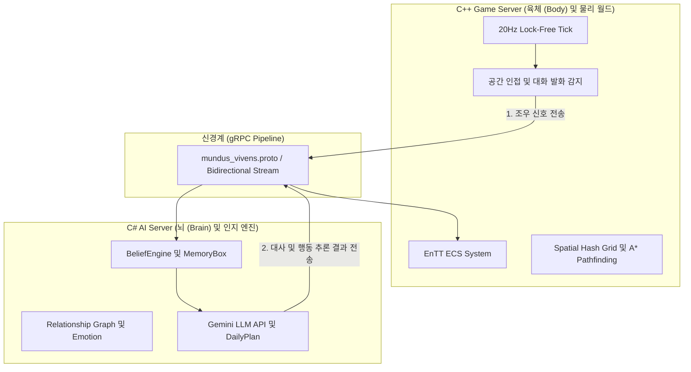

# Mundus Vivens (C++ Game Server)

Project Mundus Vivens의 고성능 C++ 게임 서버 시뮬레이터입니다. 독자적인 물리 틱을 처리하며 gRPC를 통해 C# AI 서버와 실시간으로 통신합니다.

## 기술 문서 (Documentation)

시스템 아키텍처, 에이전트 인지 모델 및 향후 개발 로드맵은 `docs/` 디렉토리에 정의되어 있습니다. 이 문서들은 개발자와 코딩 에이전트 모두가 참조하는 단일 진실의 원천(Single Source of Truth)입니다.

- [00_project_overview.md](../MundusVivens/docs/00_project_overview.md)
- [01_architecture.md](../MundusVivens/docs/01_architecture.md)
- [02_agent_design.md](../MundusVivens/docs/02_agent_design.md)
- [03_phase7_roadmap.md](../MundusVivens/docs/03_phase7_roadmap.md)

## 시스템 아키텍처 (System Architecture)

본 프로젝트는 물리/공간 시뮬레이션을 전담하는 C++ 서버(육체)와 사회적 인지/LLM 연동을 담당하는 C# 서버(뇌)가 철저히 분리된 분산 아키텍처로 동작합니다.



## 주요 기능

- **3-스레드 리액터 모델**: 데이터 레이스를 차단하기 위해 I/O, 메인 게임루프(20Hz), gRPC 통신 스레드를 엄격히 분리하여 락(Lock) 없이 구동됩니다.
- **ECS (Entity Component System)**: EnTT 라이브러리를 활용하여 NPC의 상태, 공간 해시 그리드 기반의 최적화된 거리 연산을 수행합니다.
- **공간 기반 대화 트리거**: 물리적 거리와 기존 관계 수치를 바탕으로 대화 주도, 수락 및 제일차 합류 확률을 수학적으로 계산하여 대화 이벤트를 발생시킵니다.

## 빌드 및 실행

1. **요구 사항**: Visual Studio 2022 (C++ 데스크톱 개발 워크로드), CMake, vcpkg가 필요합니다.
2. **자동 빌드 스크립트**: 동봉된 파워쉘 스크립트를 실행하면 vswhere를 통한 경로 탐색과 CMake 프리셋 빌드가 자동으로 진행됩니다.

   ```powershell
   .\build_local.ps1
   ```

3. **실행**: 성공적으로 빌드된 후 `out/build/windows-default/MundusVivensGameServer.exe`를 실행합니다.
