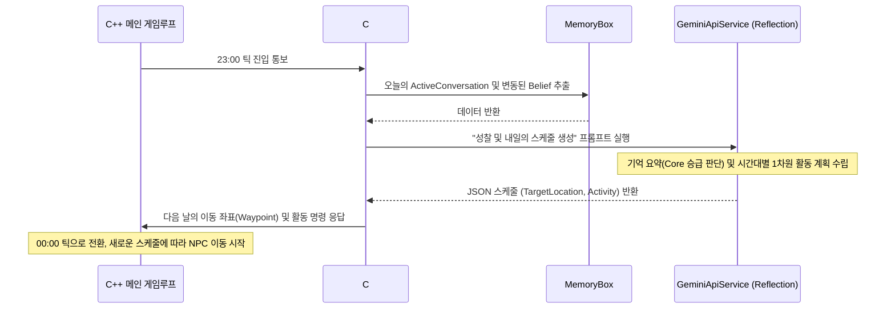

# 🧠 Mundus Vivens: Agent Cognitive Design & Memory Systems

이 문서는 NPC 에이전트의 인지, 기억 체계(Belief), 성찰 및 행동 스케줄링을 규정하는 **살아있는 설계 백서(Living Spec)**입니다. 코딩 에이전트는 이 문서의 수식과 구현 링크를 기준으로 코드를 검증하고 리팩토링을 수행합니다.

---

## <memory_and_belief_system>
### 1. 통합 믿음(Belief) 엔진과 기억 쇠퇴

에이전트의 모든 기억은 파편화된 리스트가 아닌 단일 `Belief` 구조체로 통일되어 관리되며, 시간에 따라 쇠퇴(Decay)하고 중요도에 따라 소멸(Eviction)됩니다.

`[IMPLEMENTED]` 모델 구조는 [BeliefModels.cs](file:///C:/Users/adg01/Documents/GitHub/MundusVivens/MundusVivens.Prototype/Models/BeliefModels.cs)와 [MemoryModels.cs](file:///C:/Users/adg01/Documents/GitHub/MundusVivens/MundusVivens.Prototype/Models/MemoryModels.cs)에 정의되어 있습니다.

#### 📊 믿음 중요도(Importance) 계산 공식
믿음이 메모리 예산(`MaxTotalBeliefs = 40`)을 초과할 때, 중요도가 가장 낮은 일반 기억부터 강제 소멸(Evict)됩니다.
`Importance = (Confidence * 0.4) + (Salience * 0.35) + (EmotionalCharge * 0.25)`

#### 🔄 메모리 강등 및 소멸(Eviction) 규칙
1.  **Core 예산 초과 시 강등**: 코어 신념은 최대 5개(`MaxCoreBeliefs = 5`)까지만 유지됩니다. 새로운 Core가 들어와 5개를 초과하면 가장 `Importance`가 낮은 Core 믿음은 `Witnessed` 타입으로 **강등(Demoted)**됩니다.
2.  **일반 예산 초과 시 소멸**: 전체 기억이 40개(`MaxTotalBeliefs = 40`)를 초과하면, `Type != Core`인 일반 기억 중 가장 `Importance`가 낮은 기억이 영구 삭제됩니다.

#### 📉 기억 쇠퇴율 (Salience Decay)
매 논리 틱마다 각 Belief 타입별로 `Salience`가 차등 감소합니다. (처리: [BeliefEngine.cs](file:///C:/Users/adg01/Documents/GitHub/MundusVivens/MundusVivens.Prototype/Services/BeliefEngine.cs))
*   `Core`: -0.001 per tick (매우 느림)
*   `Witnessed`: -0.002 per tick (직접 목격)
*   `Heard`: -0.005 per tick (전해 들음)
*   `Overheard`: -0.010 per tick (엿들음, 가장 빠름)
*   *(특수 룰)*: 기억을 다른 NPC에게 발설(`SharedWith`에 추가)하면 해당 기억의 쇠퇴율은 절반(`* 0.5`)으로 영구 감속합니다.
</memory_and_belief_system>

---

## <reflection_and_scheduling>
### 2. 일일 성찰 및 행동 스케줄링 (Daily Plan)

에이전트는 하루 24시간을 틱(0-23틱)으로 분할하여 행동하며, 23:00 틱에 도달하면 오늘 겪은 대화와 목격 사실을 종합하여 "성찰(Reflection)"을 수행하고 내일의 스케줄을 생성합니다.

`[IMPLEMENTED]` 스케줄 생성 로직은 [DailyPlanService.cs](file:///C:/Users/adg01/Documents/GitHub/MundusVivens/MundusVivens.Prototype/Services/DailyPlanService.cs)에, 좌표 레지스트리는 [LocationCoordinateRegistry.cs](file:///C:/Users/adg01/Documents/GitHub/MundusVivens/MundusVivens.Prototype/Models/LocationCoordinateRegistry.cs)에 구현되어 있습니다.

#### 🔀 스케줄 생성 사이클

</reflection_and_scheduling>
