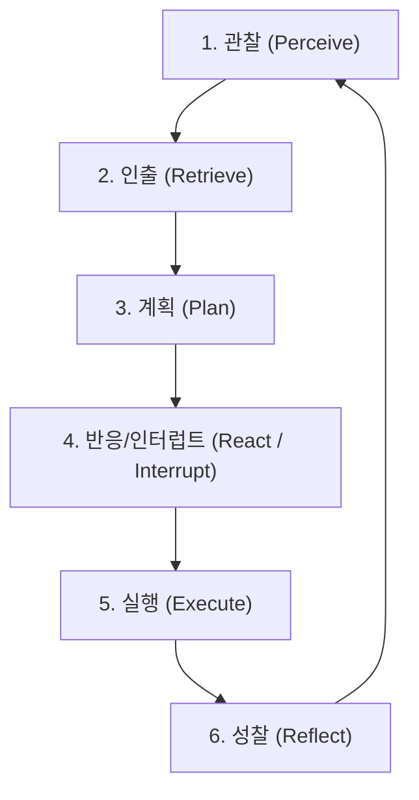
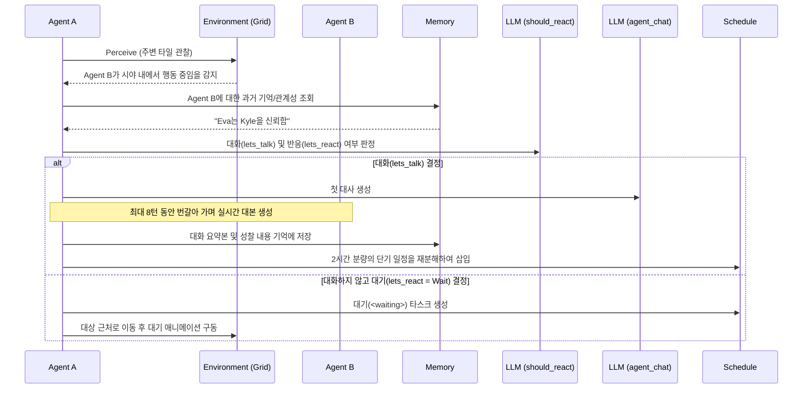

# 스몰빌(Smallville - Generative Agents) 에이전트 행동 및 의사결정 구조 분석 보고서

이 보고서는 스탠퍼드 대학의 **Generative Agents (Smallville)** 프로젝트(Park et al., ACM CHI 2023)의 논문 및 오픈소스 코드를 바탕으로, 에이전트의 인지 루프와 행동 실행 메커니즘, 그리고 구조적 한계점을 분석한 문서입니다.

---

## 1. 스몰빌의 전체 인지 루프 (Cognitive Loop)

스몰빌 에이전트의 하루는 시뮬레이션의 매 틱(Tick)마다 실행되는 `move()` 함수를 중심으로 **[관찰 ➔ 인출 ➔ 계획 ➔ 반응 ➔ 실행 ➔ 성찰]**의 순환 구조를 그립니다.

### I. 관찰 (Perceive)
*   **원리**: 매 틱마다 에이전트의 시야 반경(vision radius) 내의 타일에 존재하는 이벤트(다른 에이전트의 대화, 오브젝트 상태 변화 등)를 감지합니다.
*   **필터링**: 관찰 과부하를 막기 위해 같은 구역(Arena) 내의 이벤트만 감지하고, 너무 많은 이벤트가 존재하면 가장 가까운 $N$개로 한정(att_bandwidth)합니다.
*   **기록**: 감지된 사건은 주어-술어-목적어의 세 축(SPO Triple) 형식(예: `Isabella Rodriguez, is, writing a novel`)으로 포맷팅되어 **연상 기억(Associative Memory)** 저장소에 기록되며, LLM이 1~10점 사이의 중요도(Poignancy) 점수를 매깁니다.

### II. 인출 (Retrieve)
*   **원리**: 주변 자극이 감지되면 관련된 기억을 뇌에서 꺼냅니다.
*   **인출 공식**: 메모리 검색 시 세 가지 가중치를 합산하여 가장 점수가 높은 기억들을 추출합니다.
    $$\text{Score} = w_{recency} \times \text{최근성} + w_{importance} \times \text{중요도} + w_{relevance} \times \text{의미론적 유사도}$$
    *   **최근성**: 마지막으로 접근한 시간부터 기하급수적으로 감쇠(Decay).
    *   **중요도**: 생성 시 LLM이 평가한 중요도 점수.
    *   **유사도**: 쿼리와 메모리 노드 간의 임베딩 코사인 유사도.

### III. 계획 (Plan)
*   **장기 계획**: 매일 아침 에이전트는 하루 일과(예: 07:00 기상, 08:00 아침 식사, 09:00~13:00 집필)의 거시적인 계획을 작성합니다.
*   **단기 계획 분해**: 행동 시간이 다가오면, 에이전트는 계획을 5분~15분 단위의 아주 미세한 테스크(Decomposition Task)로 쪼개어 구체적인 행동과 대상 오브젝트를 지정합니다.

### IV. 반응 / 인터럽트 (React)
*   일정 수행 중 새로운 사건(예: 다른 NPC가 다가오거나 화재 발생)을 목격하면, 관련 기억을 인출한 뒤 LLM에게 **"현재 일정을 중단하고 이 사건에 반응해야 하는가?"**를 물어봅니다.
*   반응하기로 결정했다면 일정을 긴급 재조정하고 대화나 대기 상태로 전환합니다.

### V. 실행 (Execute)
*   결정된 추상적 행동(예: "아침 식사 요리하기")을 인지하여 맵 상의 물리적 좌표를 계산하고 A* 알고리즘을 이용해 길을 찾고, 대상 오브젝트의 상태(예: 가스레인지 상태를 `off`에서 `cooking`으로 변경)를 업데이트합니다.

### VI. 성찰 (Reflect)
*   **주기적 성찰**: 획득한 기억들의 누적 중요도 점수가 특정 기준치(예: 150점)를 초과하면, 에이전트는 행동을 멈추고 과거 기억들을 요약/분석하여 **"클라우스는 젠트리피케이션 문제에 관심이 많다"**와 같은 고차원적인 통찰(Insight)을 뽑아내어 기억 저장소에 주입합니다.
*   **대화 후 성찰**: 대화가 끝나면 즉시 대화 내용을 바탕으로 상대방과의 관계 변화 및 향후 대화 계획을 반영하는 성찰을 수행합니다.

---

## 2. 행동 생성 및 월드 물리 실행 프로세스

추상적인 natural language 계획(예: "커피 내리기")이 어떻게 가상 세계의 좌표로 변환되어 물리적으로 실행되는지의 단계입니다.

### 계층형 공간 메모리 (Spatial Memory)
에이전트들은 가상 월드를 트리 구조의 계층 형태로 뇌 속에 들고 있습니다.
$$\text{World (Smallville)} \rightarrow \text{Sector (Isabella's apartment)} \rightarrow \text{Arena (kitchen)} \rightarrow \text{Object (stove)}$$

1.  **목표 주소 도출**: LLM에게 행동 계획과 에이전트가 알고 있는 공간 트리를 제공하고 목표 오브젝트의 최종 주소(예: `kitchen:stove`)를 텍스트로 얻어냅니다.
2.  **좌표 해상도 분석**: 게임 맵의 타일셋 데이터베이스를 조회하여 해당 오브젝트가 위치한 타일 좌표 목록을 찾습니다.
3.  **충돌/혼잡 회피**: 해당 타일에 이미 다른 에이전트가 행동 중인지(Occupied) 검사하여 비어있는 타일을 대상 타일로 낙점합니다.
4.  **A* 길찾기**: 획득한 타일까지의 경로를 계산하여 캐릭터를 한 칸씩 이동시킵니다.
5.  **오브젝트 상태 쓰기**: 도착하면 오브젝트의 전역 상태 값을 변경하여(예: `stove: off` ➔ `stove: cooking`), 주변의 다른 에이전트들이 이를 목격하고 반응할 수 있도록 환경 데이터를 업데이트합니다.

---

## 3. 반응(Reaction) 및 대화 트리거 메커니즘

에이전트가 다른 캐릭터를 만났을 때 대화할지 여부를 판정하고, 일정을 조율하는 인터럽트 흐름입니다.

*   **대화 필터링 룰 (lets_talk)**: LLM의 과도한 호출을 줄이기 위한 안전장치들입니다.
    *   두 에이전트 중 한 명이라도 수면 상태이거나, 밤 11시(23시) 이후인 경우 대화를 나누지 않습니다.
    *   상대방이 다른 NPC와 대화 중이거나, 이미 대기 상태(`<waiting>`)인 경우 대화를 걸지 않습니다.
    *   방금 대화를 마친 상태라면, **대화 방지 쿨타임 버퍼(`chatting_with_buffer`)**를 두어 800틱(Tick) 동안 서로에게 다시 대화를 걸지 못하게 만듭니다. (무한 인사 루프 방지)

---

## 4. 스몰빌 행동 실행 모델의 6가지 한계점

스몰빌은 훌륭한 사회적 시뮬레이션을 보여주었지만, 실제 상용 게임 엔진에 적용하기에는 치명적인 설계 결함들을 갖고 있습니다.

1.  **기억 변질 및 환각 루프 (Hallucination Loop)**:
    *   LLM이 관찰이나 성찰 단계에서 한 번이라도 사실이 아닌 정보(환각)를 진짜라고 기록하면, 그 거짓 정보가 영구적인 사실로 기억에 저장됩니다. 이를 수정하거나 교차 검증하는 시스템이 없기 때문에 시간이 흐를수록 에이전트의 행동이 광적으로 변질되는 현상이 일어납니다.
2.  **지나치게 성긴 시간 해상도 (Temporal Resolution)**:
    *   에이전트의 일정 분해(Decomposition)는 최소 5분~15분 단위로 이루어집니다. 이 때문에 행동을 빨리 끝마치더라도 다음 시간 블록이 올 때까지 그냥 멀뚱히 대기(`<waiting>`)해야 하는 부자연스러운 병목 시간이 자주 발생합니다.
3.  **하드코딩된 예외 규칙의 비대화**:
    *   대화 방지 쿨타임(`chatting_with_buffer`)이나 야간 대화 금지 시간 설정 같은 규칙들을 하드코딩으로 막아두었습니다. 만약 이 규칙이 없다면 LLM이 매 틱마다 대화 신청 여부를 결정하기 때문에 무한 반복 인사나 무한 수다 루프에 빠지게 됩니다.
4.  **사회적 에티켓 및 물리 법칙 무시**:
    *   물리적인 방 번호나 문(Door)에 락을 걸지 않으면, 에이전트들은 프롬프트로만 "사생활"을 이해할 뿐 실제로는 좁은 화장실이나 개인 침실에 4~5명이 동시에 밀고 들어가 사생활을 침해하는 부자연스러운 공간 겹침이 자주 일어납니다.
5.  **극도로 추상화된 액션 레이어**:
    *   "요리하기"는 그저 가스레인지 앞으로 걸어가서 데이터베이스의 텍스트 상태를 바꾸는 것에 불과합니다. 칼을 들거나 냄비를 씻는 것과 같은 구체적인 운동 제어(Motor control)나 순차적인 물리 상호작용 레이어가 없어 다채로운 상용 게임 액션을 렌더링하기 어렵습니다.
6.  **스케일아웃 및 비용 병목 (Cost & Latency)**:
    *   틱이 진행되고 일수가 늘어날수록 뇌 속의 임베딩 기억 노드가 비대해져 LLM이 매번 읽어야 하는 컨텍스트의 양이 수만 토큰으로 치솟습니다. 이는 막대한 API 사용료와 응답 시간 지연(latency)으로 직결되어 실시간 구동을 원천적으로 차단합니다.
